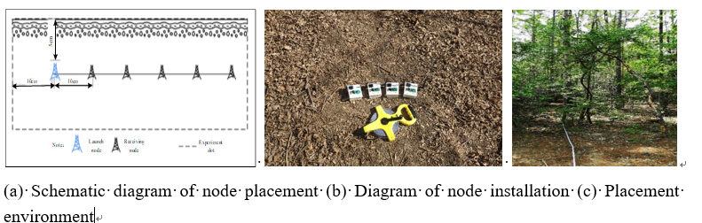
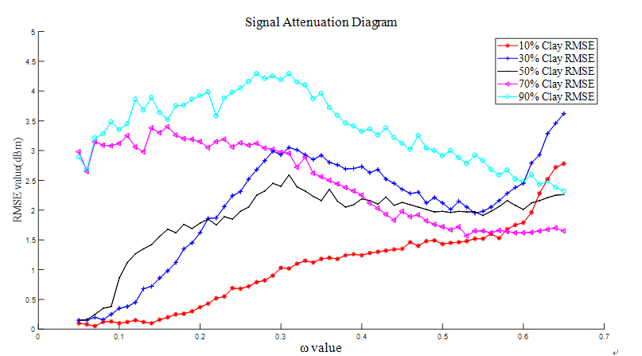

# Self-adjusting Parametric Model of WUSN Signal

### **[A Self-adjusting Parametric Model for Attenuation Characteristics of WUSN Signal](https://arxiv.org/abs/2209.14156) [NeurIPS 2022 [bib](https://github.com/xieyonghao/WUSN Signal#citation)]**  
[Jiwe Zhang], [Yonghao Xie](https://github.io/xieyonghao), [Mingze Yuan], [Mingbao Li*]   

we proposed a **fusion optimization model**, and proposed an **improved Genetic Algorithm**, which is automatically adjust fusion parameter according to soil and distance factors, it made the prediction of signal attenuation under different soil components more accurately

## Introduction
<!-- <p align="center">
  <big><b>A Self-adjusting Parametric Model for Attenuation Characteristics of WUSN Signal (Canadian Journal of Soil Science 2022)</b></big>
</p>


<p align="center">
  <big><b>Jiawei Zhang, Yonghao Xie, Mingze Yuan, Mingbao Li</b></big>
</p> -->

a low-power wireless underground sensor network nodes was designed.  

<p align="center">
  
</p>

we analyzed the attenuation prediction values of the **modified Frisian transmission model** and the **complex refractive index Fresnel model** under different soil components, targeting their weaknesses and combining their strengths. The result is not good.

<p align="center">
  
</p>


TVLT is pre-trained with vision-audio mathcing and mask autoencoding **(mask and then reconstruct the continuous input of video frames and audio spectrogram)**, following the previous idea of [training scalable vision learners with mask autoencoding on images (the Vision-BERT)](https://arxiv.org/abs/2111.06377).    

<p align="center">
  
</p>


TVLT attains performance comparable to its text-based counterpart on various multimodal tasks, such as visual question answering and multimodal sentiment analysis, **with 28x faster inference speed and only 1/3 of the parameters**.

<p align="center">
  
</p>


## Install
### Setup `python` environment
```
conda create -n TVLT python=3.8   # You can also use other environment.
```

### Install `pytorch`, `torchvision`, and `torchaudio`
The following version have been tested.  
* `torch  1.10.0  1.12.1`
* `torchvision  0.11.1  0.12.1` 
* `torchaudio  0.10.0  0.13.1`  

You can try other version of `pytorch` but make sure that it will be compatible with your `cuda` and `cudnn`.  

### Install other dependencies
```
pip install -r requirements.txt
```
<!-- 
## Model Weights
[Huggingface Hub](https://huggingface.co/TVLT/models). -->

## Demos
Getting familiar with TVLT by trying the following demos.

* [Masked Autoecoding on Video Frames and Audio Spectrogram](Demo_Video_Audio_MAE.ipynb) [](https://colab.research.google.com/github/zinengtang/TVLT/blob/main/Demo_Video_Audio_MAE.ipynb)
* [Sentiment Analysis on Video and Audio](Demo_Sentiment_Analysis.ipynb) [](https://colab.research.google.com/github/zinengtang/TVLT/blob/main/Demo_Sentiment_Analysis.ipynb)
* [Emotional Analysis on Video and Audio](Demo_Emotional_Analysis.ipynb) [](https://colab.research.google.com/github/zinengtang/TVLT/blob/main/Demo_Emotional_Analysis.ipynb)

<!-- <p align="center">
  <big><b>Demos Exmaples</b></big>

</p> 

<p align="center">
  
  
  
</p> -->


## Training

### Pretraining (Data + scripts) -> [TVLT Pretraining](PT.md)

```
# Example
bash scripts/pretrain_mae_vam.sh
```

### Finetuning on Downstream (Data + scripts) -> [TVLT Finetuning](DS.md)

```
# Example
bash scripts/finetune_mosei.sh
```

## Released Models

The model weights are hosted in [Huggingface Hub](https://huggingface.co/TVLT/models/tree/main).  
If you have tried the demos, some models should have already been downloaded.

The details of each released TVLT models are described in the table below.  

| Training    | Input Format | Component | Link |
| --- | --- | --- | --- |
| Pre-trained on Howto100m + Yttemporal videos|Video 👁+ Audio👂|Encoder + Decoder|[[link]](https://huggingface.co/TVLT/models/resolve/main/TVLT.ckpt)|
| Pre-trained on Howto100m + Yttemporal videos, then finetuned on CMU-MOSEI sentiment analysis|Video 👁+ Audio👂|Encoder + Classification Head|[[link]](https://huggingface.co/TVLT/models/resolve/main/TVLT-MOSEI-SA.ckpt)|
| Pre-trained on Howto100m + Yttemporal videos, then finetuned on CMU-MOSEI emotional analysis|Video 👁+ Audio👂|Encoder + Classification Head|[[link]](https://huggingface.co/TVLT/models/resolve/main/TVLT-MOSEI-EA.ckpt)|
| {re-trained on Howto100m + Yttemporal videos+ASR, then finetuned on CMU-MOSEI emotional analysis|Video 👁+ Text✍️|Encoder + Classification Head|[[link]](https://huggingface.co/TVLT/models/resolve/main/TVLT-MOSEI-EA-text.ckpt)|

**To be contined...** (Stay tuned, more pre-trained variants coming soon)
<!-- * A TVLT model pre-trained on Howto100m + Yttemporal videos, then finetuned on CMU-MOSEI sentiment analysis:  -->

<!-- * A TVLT model on CMU-MOSEI emotional analysis 

* Finetuned (Text-based) on CMU-MOSEI emotional analysis [[link]](https://huggingface.co/TVLT/models/resolve/main/TVLT-MOSEI-EA-text.ckpt) -->

<!-- and specify with command "load_local_path".

```
load_local_path="path/to/the/checkpoint"
```

Or use comman "load_hub_path", which will automatically download model for training scripts.

```
load_hub_path="TVLT.ckpt"
``` -->

## Folder Structure

See [Folder Structure](CODE.md)

## Updates
- [x] Initial Code Release
- [x] Notebook Demos
- [x] Colab
- [ ] Release TTS question audios for VQA (We convert all the textual questions of VQAv2 to audio using Google TTS API.)   

**...**


## Recommanded Usage

In our experiment, we pre-train TVLT on HowTo100M and YTtemporal videos. However, we recommend to unlock the power of TVLT by pre-training TVLT on large-scale videos for more generic Vision-Language representation.  
The resultant models can be either use to directly process video (with the audio channel) inputs such as audio-image/video retrieval, audio-VQA, TTS-based VQA or to extract visual-acoustic features for other tasks such as speech translation, multimodal content understanding, etc.


## Citation
```
@inproceedings{tang2022tvlt,
  title     = {TVLT: Textless Vision-Language Transformer},
  author    = {Zineng Tang and Jaemin Cho and Yixin Nie and Mohit Bansal},
  booktitle = {NeurIPS},
  year      = {2022}
}
```

## Acknowledgement

The idea of this paper is heavily inspired by [Masked Autoencoders Are Scalable Vision Learners](https://arxiv.org/abs/2111.06377).  
Our codebase is based on [ViLT](https://github.com/dandelin/ViLT). 
We thank the authors for their open-source contributions.

## Contact

Zineng Tang (zn.tang.terran@gmail.com)
